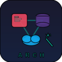

<p align="center">
  
</p>

<h1 align="center">ArchSketch</h1>

<p align="center">
  <strong>Generate cloud architecture diagrams from natural language using AI — right inside VS Code.</strong>
</p>

<p align="center">
  <a href="https://github.com/worklifesg/arch-sketch/actions/workflows/ci.yml"></a>
  <a href="https://github.com/worklifesg/arch-sketch/actions/workflows/security.yml"></a>
  <a href="https://open-vsx.org/extension/worklifesg/archsketch"></a>
  
  
</p>

---

ArchSketch uses GitHub Copilot's Language Model API to turn plain English descriptions into editable [draw.io](https://www.diagrams.net/) diagrams. No API keys needed — it uses your existing Copilot subscription.

## Features

### Natural Language → Diagram

Describe your architecture in plain English, get a fully rendered, editable diagram in seconds.

> *"3-tier AWS web app with ALB, ECS Fargate, and Aurora PostgreSQL"*

### Multi-Provider Shape Library (30+ shapes)

| Provider | Shapes |
|----------|--------|
| **AWS** | EC2, Lambda, ECS, EKS, ALB, CloudFront, S3, RDS, DynamoDB, SQS, SNS, Cognito |
| **Azure** | VM, App Service, AKS, Functions, SQL Database, Cosmos DB |
| **GCP** | GCE, Cloud Run, GKE, Cloud SQL, Pub/Sub, BigQuery |
| **Kubernetes** | Pod, Deployment, Service, Ingress, ConfigMap, Secret |

### Starter Templates

Get started fast with 5 pre-built architecture templates:

- **AWS 3-Tier** — CloudFront → ALB → EC2 Auto Scaling → RDS Multi-AZ
- **AWS Serverless** — API Gateway → Lambda → DynamoDB + S3 + Cognito
- **K8s Microservices** — Ingress → API Gateway → Microservices + PostgreSQL + Redis
- **Azure Web App** — Front Door → App Service → SQL Database + Azure AD + Key Vault
- **GCP Data Pipeline** — Pub/Sub → Dataflow → BigQuery + Cloud Storage + Looker

### Code Scanning (IaC → Diagram)

Generate architecture diagrams directly from your infrastructure code:

- **Single file** — Scan the active editor file
- **Multi-file** — Scan a folder with cross-file reference analysis
- **Workspace** — Scan the entire workspace for IaC files

Supported formats: **Terraform** (.tf), **CloudFormation** (YAML/JSON), **Kubernetes** manifests (YAML)

Cross-file intelligence detects module references, `Ref`/`GetAtt`, label selectors, volume claims, and more.

### Iterative AI Refinement

Chat-style refinement in the diagram editor — modify, expand, or restructure your architecture through conversation without starting over.

### Sidebar Panel

A dedicated activity bar panel with three tabs:

- **Generate** — Text input with provider selector and Ctrl+Enter shortcut
- **Templates** — Browse and load starter templates with preview cards
- **Shapes** — Drag-and-drop shape palette filtered by provider

### Export

Save diagrams in multiple formats:

| Format | Use Case |
|--------|----------|
| `.drawio` | Editable diagram file |
| SVG | Scalable vector for docs |
| PNG | Raster image for sharing |
| HTML | Embeddable interactive diagram |

## Quick Start

### Installation

#### From GitHub Releases (recommended for VS Code)

1. Download the latest `.vsix` from **[GitHub Releases](https://github.com/worklifesg/arch-sketch/releases/latest)**
2. In VS Code, open the Command Palette (`Ctrl+Shift+P` / `Cmd+Shift+P`)
3. Run **"Extensions: Install from VSIX..."**
4. Select the downloaded `.vsix` file

Or install via CLI:

```bash
# Download and install the latest release
gh release download --repo worklifesg/arch-sketch --pattern "*.vsix" --dir /tmp
code --install-extension /tmp/archsketch-*.vsix
```

#### From Open VSX Registry (for VSCodium / Gitpod / Theia)

Search for **"ArchSketch"** in the extension marketplace, or install from the command line:

```bash
# VSCodium
codium --install-extension worklifesg.archsketch
```

Browse it on [Open VSX](https://open-vsx.org/extension/worklifesg/archsketch).

### Usage

1. Open the Command Palette (`Ctrl+Shift+P` / `Cmd+Shift+P`)
2. Run **"ArchSketch: Generate Cloud Architecture Diagram"**
3. Describe your architecture in plain English
4. Edit the generated diagram in the embedded draw.io editor
5. Export as SVG, PNG, .drawio, or HTML embed

**Or** use the ArchSketch sidebar panel in the activity bar for a guided experience.

## Requirements

- VS Code 1.90.0+
- [GitHub Copilot](https://marketplace.visualstudio.com/items?itemName=GitHub.copilot) extension (provides the AI model)

## Commands

| Command | Description |
|---------|-------------|
| `ArchSketch: Generate Cloud Architecture Diagram` | Generate a diagram from a text description |
| `ArchSketch: Open .drawio in Preview` | Open an existing .drawio file in the editor |
| `ArchSketch: Generate Diagram from Code` | Scan the active file for IaC and generate a diagram |
| `ArchSketch: Scan Folder for Architecture Diagram` | Multi-file IaC scan with folder picker |
| `ArchSketch: Scan Workspace for Architecture Diagram` | Scan the entire workspace |
| `ArchSketch: Export as SVG` | Export the current diagram as SVG |
| `ArchSketch: Export as PNG` | Export the current diagram as PNG |
| `ArchSketch: Export HTML Embed Code` | Copy an HTML embed snippet to clipboard |

## Settings

| Setting | Default | Description |
|---------|---------|-------------|
| `archsketch.defaultProvider` | `aws` | Default cloud provider (aws, azure, gcp, kubernetes, general) |
| `archsketch.theme` | `auto` | draw.io editor theme (light, dark, auto) |
| `archsketch.defaultExportFormat` | `svg` | Default export format (svg, png, drawio) |

## Use Cases

- **Architecture reviews** — Quickly visualize and iterate on system design
- **Documentation** — Generate up-to-date diagrams from live Terraform/CloudFormation
- **Learning** — Explore cloud service relationships visually
- **Presentations** — Export polished diagrams for slides and docs
- **Code auditing** — Scan existing IaC to understand what's deployed

## Known Limitations

- AI-generated diagrams may need manual layout adjustments for complex architectures
- PNG export requires the draw.io editor to be open (uses the embedded renderer)
- Multi-file scanning is limited to 200KB of combined content to respect LLM context limits
- Requires an active GitHub Copilot subscription for AI features

## Troubleshooting

| Issue | Solution |
|-------|----------|
| "No language model available" | Ensure GitHub Copilot extension is installed and signed in |
| Empty or malformed diagram | Try a more specific description; include service names |
| Diagram doesn't match provider | Set `archsketch.defaultProvider` or specify the provider in your prompt |
| VSIX won't install | Check VS Code version is 1.90.0 or later |

## Development

```bash
git clone https://github.com/worklifesg/arch-sketch.git
cd arch-sketch
npm install
npm run build
```

Press `F5` in VS Code to launch the Extension Development Host.

### Testing

```bash
npm test              # Run all tests
npm run test:watch    # Watch mode
npm run test:coverage # Coverage report
```

## Contributing

See [CONTRIBUTING.md](CONTRIBUTING.md) for development setup and guidelines.

## Security

See [SECURITY.md](SECURITY.md) for vulnerability reporting and security design.

## License

[MIT](LICENSE)
